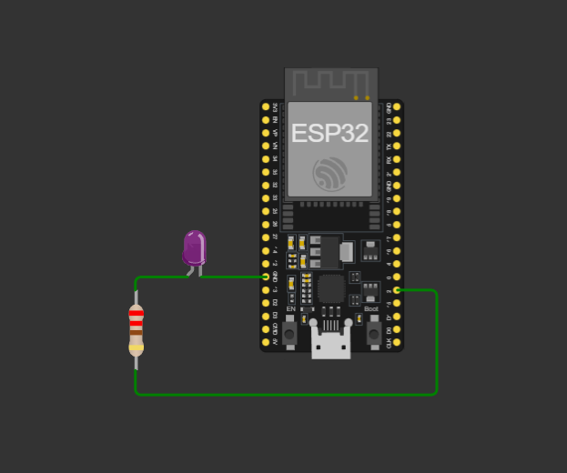

# Lab 1 — Ambientação: Ubuntu, VS Code, ESP-IDF e primeiro firmware no Wokwi

**Bancada 07 :** Hygor, Gustavo e Nalion
**Data:** 09/08/2026

---

## 1. Ambiente de desenvolvimento (Parte A)
### configuramos, mas não temos nenhum resultado pois não tiramos prints do idf.py --version 
    
## 2. Projeto Wokwi (Parte B)

- **Link do projeto (Share → Copy link):** https://wokwi.com/projects/377795564773158913



**Circuito:** GPIO2 (D2) do ESP32 → resistor de 220 Ω → anodo (A) do LED; catodo (C) do LED
→ GND.

**Comportamento observado:** LED da protoboard e o LED roxo embutido da placa piscando
juntos a 1 Hz (500 ms aceso / 500 ms apagado), com o monitor serial imprimindo:

```
LED = 1
LED = 0
LED = 1
...
```

---

## 3. Experimento 1 — Período de piscar

Alterado `vTaskDelay(pdMS_TO_TICKS(500))` para diferentes períodos e observado se o
piscar ainda é perceptível a olho nu.

| Período testado (ms) 
| Piscar perceptível? (sim/não)
| 500 (original) | sim |
| 200 | sim |
| 50 | sim |
| 20 | não |

**Menor período em que o olho ainda distingue o piscar:** 50 ms

> Esse limiar é o mesmo fenômeno de persistência da visão que será explorado na semana 8
> (PWM): o olho "integra" piscadas rápidas demais em vez de percebê-las como intermitência.

---

## 4. Experimento 2 — Assimetria (900 ms aceso / 100 ms apagado)

Trecho do laço modificado, usando dois `vTaskDelay` distintos após cada `gpio_set_level`:

```c
int nivel = 0;
while (1) {
    nivel = 1;
    gpio_set_level(PINO_LED, nivel);
    printf("LED = %d\n", nivel);
    vTaskDelay(pdMS_TO_TICKS(900));   // 900 ms aceso

    nivel = 0;
    gpio_set_level(PINO_LED, nivel);
    printf("LED = %d\n", nivel);
    vTaskDelay(pdMS_TO_TICKS(100));   // 100 ms apagado
}
```

**Observação:**  o LED passa a maior parte do tempo aceso, com um piscar rápido e curto de apagado, perceptivelmente diferente do padrão simétrico 50/50 original   

---

## 5. Experimento 3 — Atraso ocupado vs. `vTaskDelay`

**Pergunta:** se `vTaskDelay(pdMS_TO_TICKS(500))` fosse substituído por
`for (volatile long i = 0; i < 10000000; i++);`, o LED continuaria piscando — mas o que
mudaria "por dentro"?

**Resposta:**

O comportamento externo (o LED piscando) seria o mesmo, mas o que acontece "por dentro" é
completamente diferente:

1. **Uso da CPU.** O laço `for` mantém a CPU ocupada a 100% do tempo, executando
   incrementos de variável que não produzem nenhum resultado útil — é energia jogada fora
   em trabalho inútil. Já o `vTaskDelay` **bloqueia a tarefa**: ele devolve o controle da
   CPU ao escalonador do FreeRTOS, que pode colocar o processador em um estado de menor
   consumo ou usar o tempo livre para outras tarefas.
2. **Consumo de energia.** Em firmware real — especialmente em um nó alimentado por
   bateria — desperdiçar CPU é desperdiçar energia. O Exemplo resolvido 1.1 da teoria
   mostra exatamente esse efeito: um nó que consome, em média, 0,277 mA ao alternar
   corretamente entre atividade e repouso dura cerca de 10 meses com uma bateria de
   2000 mAh; se o firmware mantiver algo consumindo corrente continuamente (equivalente ao
   laço `for` ocupando 100% da CPU em vez de dormir), a mesma bateria dura apenas ~25
   horas.
3. **Conclusão.** A diferença não aparece no simulador Wokwi (que não modela consumo de
   energia), mas em hardware real ela é a diferença entre um produto que dura meses e um
   que precisa ser recarregado todo dia. Como resume a teoria: **software define o
   consumo** — nenhum hardware de baixo consumo salva um firmware mal comportado.

---

## 6. Desafio (opcional) — LED piscando "SOS" em código Morse

>codigo 

```c
#include <stdio.h>
#include "freertos/FreeRTOS.h"
#include "freertos/task.h"
#include "driver/gpio.h"

#define PINO_LED GPIO_NUM_2

void simbolo(int duracao_ms) {
    gpio_set_level(PINO_LED, 1);
    vTaskDelay(pdMS_TO_TICKS(duracao_ms));
    gpio_set_level(PINO_LED, 0);
    vTaskDelay(pdMS_TO_TICKS(200));   // pausa entre símbolos
}

void app_main(void)
{
    gpio_reset_pin(PINO_LED);
    gpio_set_direction(PINO_LED, GPIO_MODE_OUTPUT);

    while (1) {
        // S: ponto ponto ponto
        for (int i = 0; i < 3; i++) simbolo(200);
        vTaskDelay(pdMS_TO_TICKS(400)); // completa 600ms entre letras

        // O: traço traço traço
        for (int i = 0; i < 3; i++) simbolo(600);
        vTaskDelay(pdMS_TO_TICKS(400));

        // S: ponto ponto ponto
        for (int i = 0; i < 3; i++) simbolo(200);
        vTaskDelay(pdMS_TO_TICKS(1000)); // pausa maior entre repetições da palavra
    }
}
```

**Link do projeto Wokwi com o desafio:** https://wokwi.com/projects/378168339340726289
