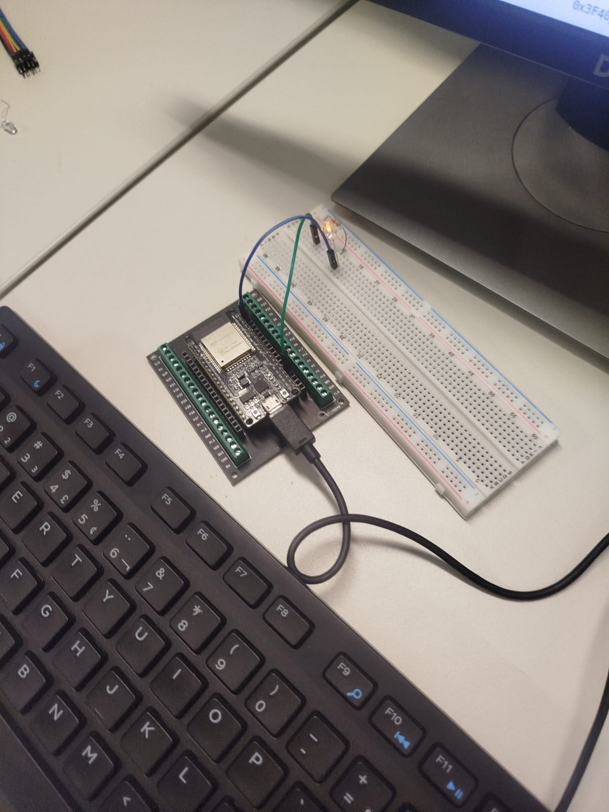
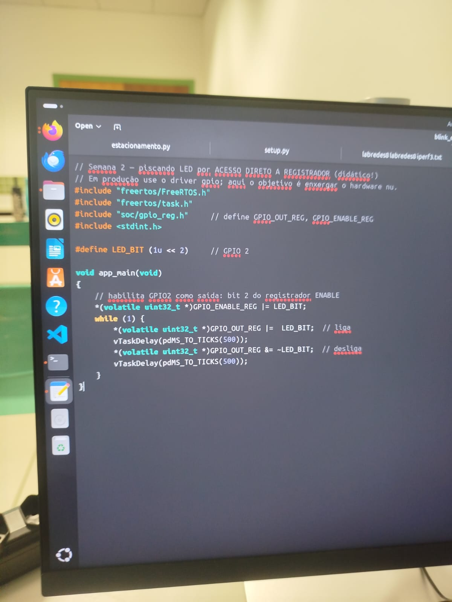
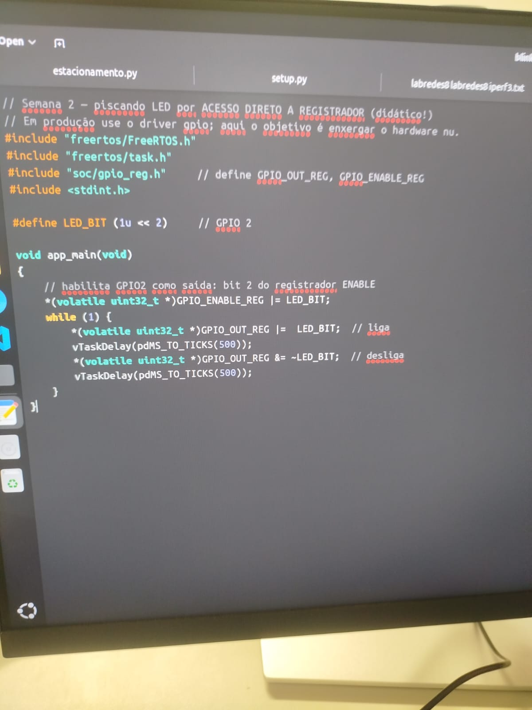
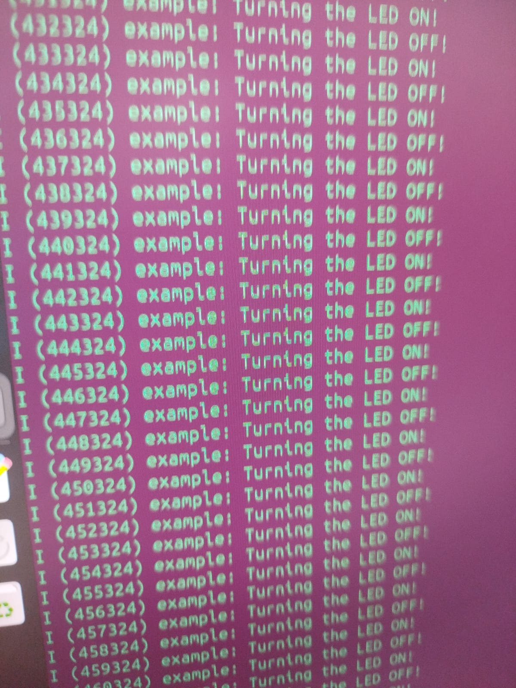

# Lab 2 — ESP-IDF no hardware: build, flash, monitor e registradores

**Bancada:** 07 — Hygor, Gustavo e Nalion
**Data:** 21/08/2026

---

## 1. Evidências Visuais (Parte A / B)

### Montagem física



Montagem na bancada: ESP32 encaixado na placa breakout com bornes, conectado à protoboard onde o LED aceso está ligado ao
GPIO 2 através de um resistor de 220 Ω, com o catodo ao GND. O módulo é alimentado por
cabo micro-USB de dados.

### Código por registrador (Parte B.1)





Código da Parte B.1 visível no editor: acesso direto aos registradores `GPIO_OUT_REG` e
`GPIO_ENABLE_REG` com operações de lê-modifica-escreve (`|=` e `&= ~`), usando a macro
`LED_BIT (1u << 2)` para o GPIO 2.

### Monitor



Monitor exibindo a oscilação contínua de mensagens `Turning the LED ON!` e
`Turning the LED OFF!`, confirmando o funcionamento do firmware de blink no ESP32 físico.

---

## 2. Análise de Memória e Gravação

### 2.1 Consumo de memória (`idf.py size`)

| Região        | Bytes usados |
|---------------|--------------|
| Flash Size    |    124kb     |
| Static IRAM   |    50,97kb   |
| Static DRAM   |    11,03kb   |


### 2.2 Layout da Flash — Endereços de gravação

O log do comando `idf.py flash` exibiu as seguintes escritas:

```
Wrote ... bytes at 0x00001000   ← bootloader
Wrote ... bytes at 0x00008000   ← tabela de partições
Wrote ... bytes at 0x00010000   ← aplicação (app)
```

| Componente         | Endereço   |
|--------------------|-----------|
| Bootloader         | 0x1000    |
| Tabela de partições| 0x8000    |
| Aplicação (app)    | 0x10000   |

**O que é gravado em `0x10000`?**
No endereço `0x10000` é gravado o binário da aplicação principal (firmware). É o código compilado do nosso programa (`app.bin`), que o bootloader carrega e executa após a inicialização do sistema. Conforme o log de boot: `Loaded app from partition at offset 0x10000`.

---

## 3. Análise Elétrica (Parte C)

### 3.1 Tabela de medições

| Medição                  | Onde                          | Valor esperado   | Medido   |
|--------------------------|-------------------------------|------------------|----------|
| Alimentação do módulo    | pino 5 V ↔ GND               | 4,75–5,25 V      | 5,03 V   |
| Nível alto no GPIO       | GPIO 2 ↔ GND (LED aceso)     | ~3,3 V           | 3,18 V   |
| Queda no LED             | anodo ↔ catodo (aceso)        | ~1,8–2,1 V       | 2,01 V   |

### 3.2 Memória de cálculo — Corrente no LED

Pela Lei de Ohm, a corrente que circula pelo circuito série (GPIO → resistor → LED → GND) é:

```
I = (V_GPIO − V_LED) / R

I = (3,18 V − 2,01 V) / 220 Ω

I = 1,17 V / 220 Ω

I ≈ 5,32 mA
```

O valor obtido (~5,3 mA) está dentro da faixa esperada de 5–6 mA, confirmando por
instrumento o cálculo do Exemplo 3.2 da teoria. O LED opera com corrente segura, bem
abaixo do limite máximo do GPIO do ESP32 (40 mA) e do LED típico (~20 mA).

---

## 4. Conceito de Atomicidade (Experimento B.3)

A abordagem clássica de "lê-modifica-escreve" (`|=` e `&= ~` sobre `GPIO_OUT_REG`) obriga o
processador a executar três operações distintas — ler o estado dos 32 pinos, alterar o bit
desejado e reescrever o registrador inteiro. Se uma interrupção (ISR) alterar outro pino do
mesmo registrador entre a leitura e a escrita, a escrita final sobrescreve silenciosamente a
alteração da ISR, causando uma **condição de corrida**. Os registradores
`W1TS` e `W1TC` resolvem esse problema de forma elegante: basta uma **única instrução de escrita** indicando quais bits devem mudar, e o
hardware do ESP32 altera exclusivamente aqueles pinos sem tocar nos demais. Por ser uma
operação **atômica** — indivisível em nível de hardware —, é impossível que uma interrupção
corrompa o estado dos outros pinos, tornando essa abordagem obrigatória em projetos
embarcados robustos e profissionais.

---
